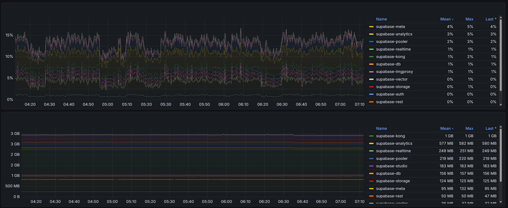

# Supabase Docker

This repository makes it easy to run [Supabase with Docker](https://github.com/supabase/supabase/tree/master/docker#self-hosted-supabase-with-docker) by removing external dependencies and simplifying the configuration process, 
without requiring shell access or additional setup steps. The project follows the same spirit of streamlined deployment popularized by [LinuxServer](https://www.linuxserver.io/our-images).

## Contribution

- Give a star
- Consider a donation
- [Ask to Supabase](https://github.com/orgs/supabase/discussions/39820) to provide a setup like this
- Open an issue or Send a PR

## Major Problems Fixed

- Extensive variable interpolation  
- Fully managed via entrypoint and healthcheck  
- Setup files embedded directly into the Docker image  
- Security:  
  - All containers isolated within an internal network  
  - Variables restricted unless shared across multiple containers  
- No need to clone the repository  
- No need to copy files  
- Docker Compose reduced from ~500 lines to fewer than 200  
- `.env` file minimized to include only required values

## Limitations

- S3-based versions were skipped for now
- Other cloud-specific features (GCP/AWS-style) were not included  
- Only essential variables are left (the commented ENV in docker compose original are removed)

## System Requirements

> [!CAUTION]
> Simply starting all images requires nearly 4 GB of RAM.  



If you don’t need the full feature set, consider using:

- [PocketBase](https://pocketbase.io/) ([pocketback-docker](https://github.com/muchobien/pocketbase-docker))
- [tinbase](https://github.com/tinbase/tinbase)
- [fluxbase](https://github.com/nimbleflux/fluxbase)

### Update Q3 2026

Now supabase added support for small deploy using sqlite compatible layer.


[supabase lite](https://www.npmjs.com/package/@supabase/lite)

## Setup

### Compose

To deploy, only the `docker-compose.yml` and `.env` is necessary.

Let's generate the keys that will need:

```sh
docker run ghcr.io/webysther/supabase-keys
```

The expected output:

```dotenv
ANON_KEY=eyJhbGciOiJIUzI1Ni...xu1mKbtI01cPB3VK58Habi3g
SERVICE_ROLE_KEY=eyJhbGciOi...Tmm_l2nVyj4JT4m2-9dO02Vw

JWT_SECRET=AFEIXyUU889o/SSRuwNgcUck9oqf+7nmouw+bieU
SECRET_KEY_BASE=HtwfNG7wM80...yIU2gGhn7uOoPgzr+q90xZhTdV
VAULT_ENC_KEY=8e4db5495998f13f69057403f65e0746
PG_META_CRYPTO_KEY=zIKlK0K1O6Wid0/WD5aRSoCdrRkj04s1
LOGFLARE_PUBLIC_ACCESS_TOKEN=gbgsCqL7IrsmMlqwJqerWSUuVv+mKmVX
LOGFLARE_PRIVATE_ACCESS_TOKEN=S3ZRbCRL0SkUGdqlJF1nF9gQUWyH+14V
POOLER_TENANT_ID=5c9dadc3759f87bd
DB_ENC_KEY=ff4095bf08ac5244899b38aff1350fdf

POSTGRES_PASSWORD=5d4a981d933446a83a338b81ebadbefe
DASHBOARD_PASSWORD=0881e0ecaa127ec5a65004e9d2d0252b
```

Add to `.env` file and deploy:

```
docker compose up
```

Remove all: 

```
docker compose down -v
```

### Portainer

Change the `x-common` to point to `.env` style of portainer and you are good to go.

### Reverse proxy

Above the table of ports:

| Port | Service |
|------|----------|
| 5432 | Pooler |
| 6543 | Pooler |
| 4000 | Analytics |
| 8000 | API Gateway (http) |
| 8443 | API Gateway (https) |

### Volumes

Only the `db-config` is necessary to be named volume.
Volumes are used to speedup the test.

### Debug

If a specific service fail, run only this service (eg. vector):

```sh
./build.sh vector --test
```

### Optimizations

- Merge some images in just one
- Maybe build an AIO image

### Allow multiple parallel instances

Kudos to @MBybee: [PR #2](https://github.com/webysther/supabase-docker/pull/2)

## Similar projects

- [supabase-automated-self-host](https://github.com/singh-inder/supabase-automated-self-host): Self-host Supabase with Nginx/Caddy and Authelia with just ONE bash script.
- [supabase-docker-compose](https://github.com/minhng92/supabase-docker-compose): Pre-configuration Supabase docker-compose with zero setup (for development environment only)
- [supabase-docker](https://github.com/alex-guoba/supabase-docker): A simple Docker setup for Supabase.

## Alternatives

- [appwrite](https://github.com/appwrite/appwrite)
- [pocketbase](https://github.com/pocketbase/pocketbase)
- [bknd](https://github.com/bknd-io/bknd)
